Aviato is the ultimate e-commerce front-end solution based on Bootstrap 3. Along with styling all default components of popular framework it introduces lots of new flexible elements you can use across the website. In total 25+ components.

<!-- demo -->
## Example Site

| [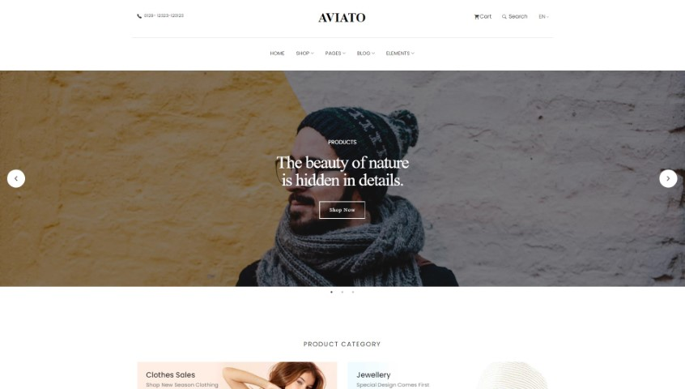](https://demo.themefisher.com/aviato/) | [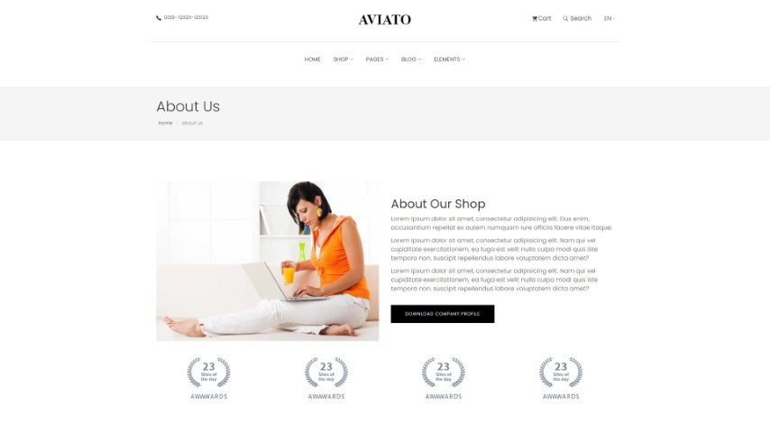](https://demo.themefisher.com/aviato/about.html) | [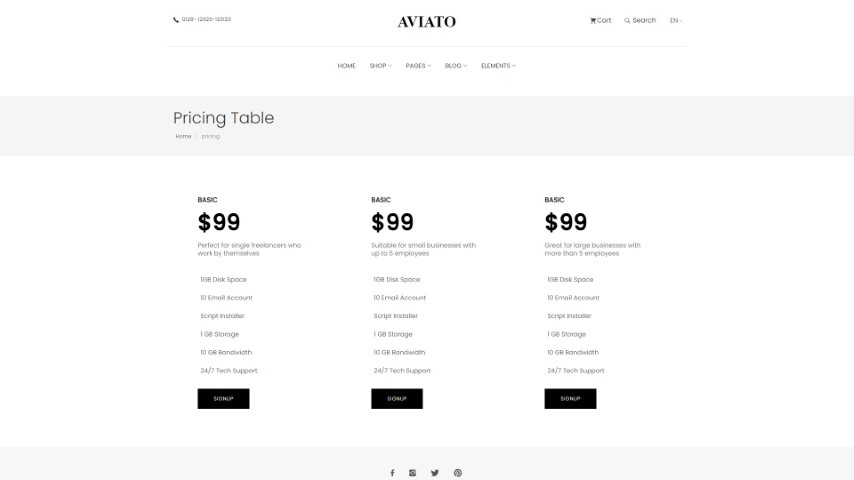](https://demo.themefisher.com/aviato/pricing.html) | [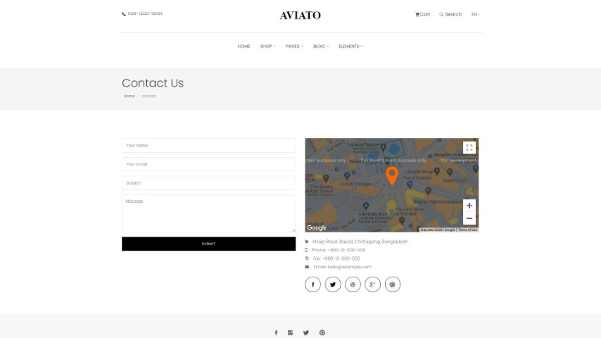](https://demo.themefisher.com/aviato/contact.html) |
|:---:|:---:|:---:|:---:|
| **Home**  | **About**  | **Pricing** | **Contact** |
| [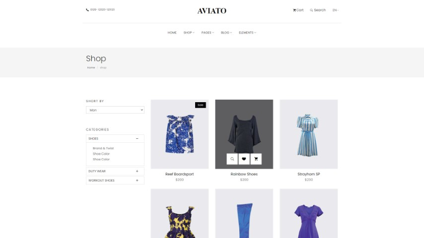](https://demo.themefisher.com/aviato/shop.html) | [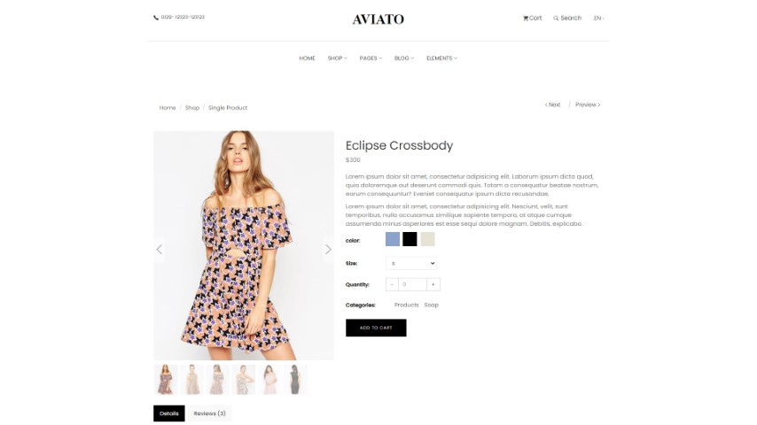](https://demo.themefisher.com/aviato/product-single.html) | [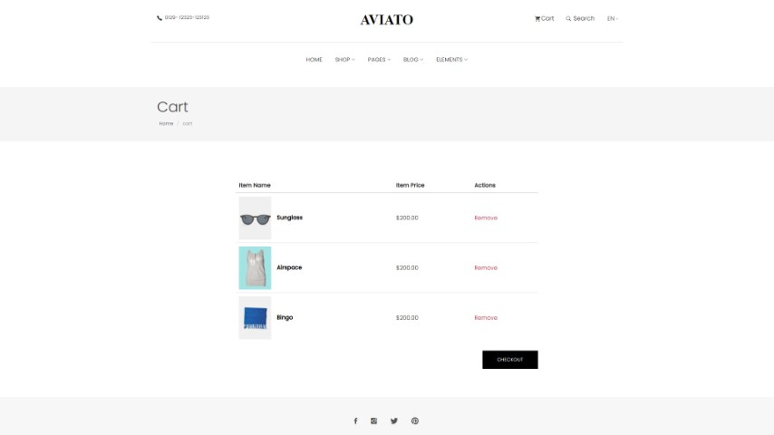](https://demo.themefisher.com/aviato/cart.html) | [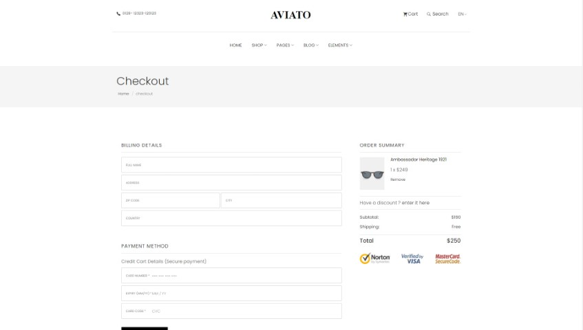](https://demo.themefisher.com/aviato/checkout.html) |
| **Shop**  | **Single Product**  | **Cart** | **Checkout** |
| [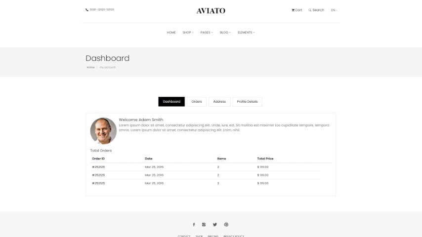](https://demo.themefisher.com/aviato/dashboard.html) | [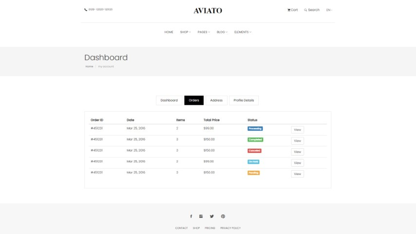](https://demo.themefisher.com/aviato/order.html) | [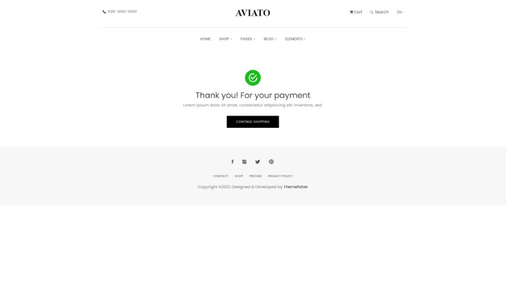](https://demo.themefisher.com/aviato/address.html) | [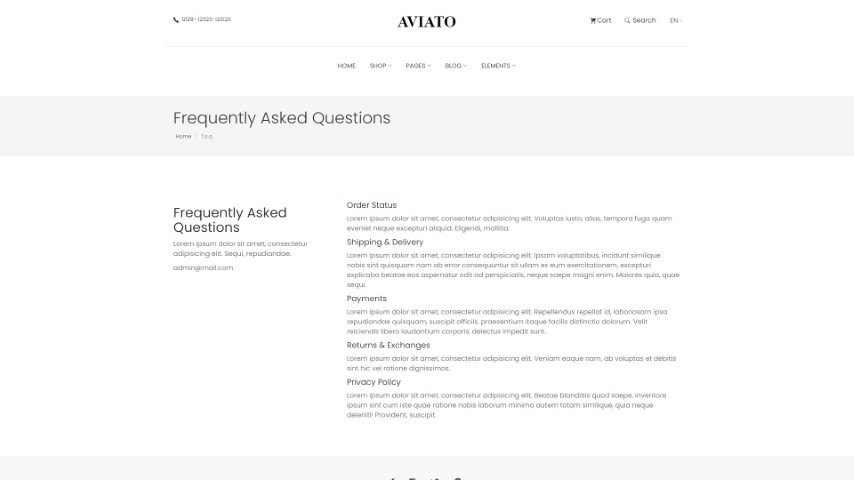](https://demo.themefisher.com/themefisher/aviato/faq.html) |
| **Dashboard**  | **Orders**  | **Payment** | **FAQ** |
| [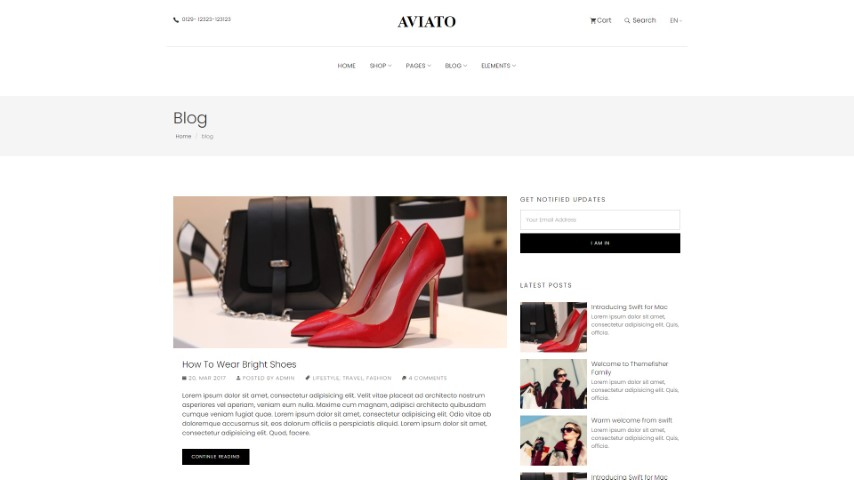](https://demo.themefisher.com/aviato/blog-right-sidebar.html) | [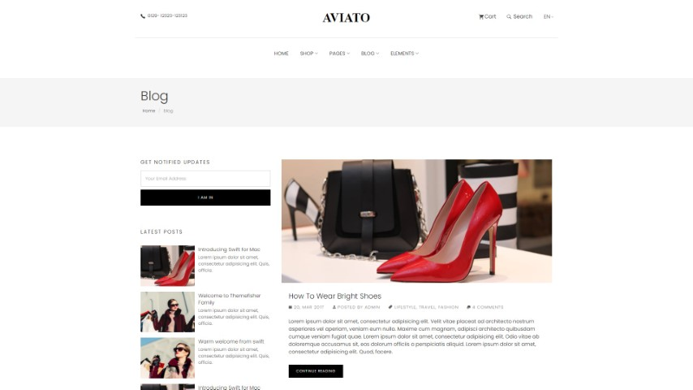](https://demo.themefisher.com/aviato/blog-left-sidebar.html) | [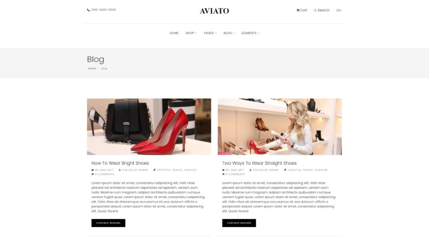](https://demo.themefisher.com/aviato/blog-grid.html) | [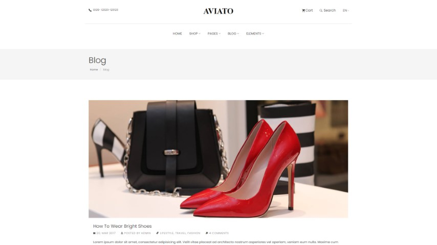](https://demo.themefisher.com/aviato/blog-full-width.html) |
| **Blog Right Sidebar**  | **Blog Left Sidebar**  | **Blog Grid** | **Blog Full Width** |

